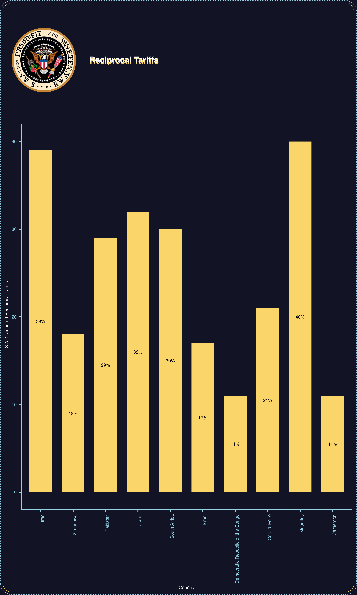

# tariffTheme

__THIS PACKAGE WAS MOSTLY BUILT BY GITHUB COPILOT. IF ANYTHING IS NOT WORKING, BLAME OUR AI OVERLORDS.__

## Installation

You can install the development version of tariffTheme from GitHub with:

```r
# install.packages("devtools")
devtools::install_github("addegezon/tariffTheme")
```

Or install the local package with:

```r
# From the parent directory of the package
devtools::install("tariffTheme")
```

## Features

- A custom `theme_tariff()` function for consistent styling of ggplot2 visualizations
- Pre-defined color schemes optimized for tariff data visualization
- Utility functions for adding logos and borders to plots
- Helper functions for consistent styling of labels and annotations
- Example dataset of country tariffs for demonstration purposes

## Usage

```r
library(ggplot2)
library(data.table)
library(tariffTheme)

# Create a basic plot with the tariff theme
p <- ggplot(country_tariffs[sample(.N, 10)], 
           aes(x = country, y = reciprocal_tariff_adjusted)) +
  geom_bar(stat = "identity", fill = yellow_color) +
  labs(title = "Reciprocal Tariffs") +
  theme_tariff()

# Add logo and styled borders
final_plot <- add_logo(p)
print(final_plot)
```



## Dependencies

This package depends on:
- ggplot2
- cowplot
- magick
- grid
- data.table

## License

This package is released under the MIT License.